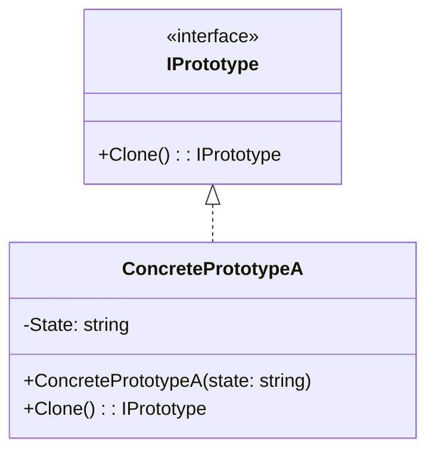
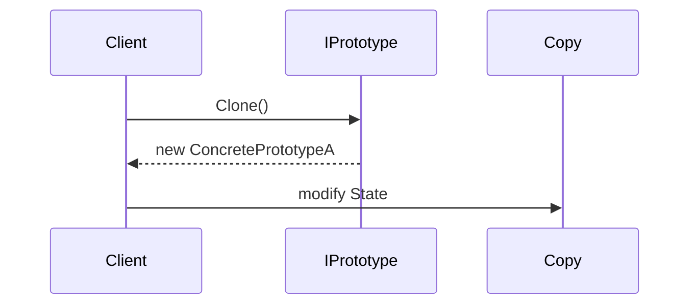
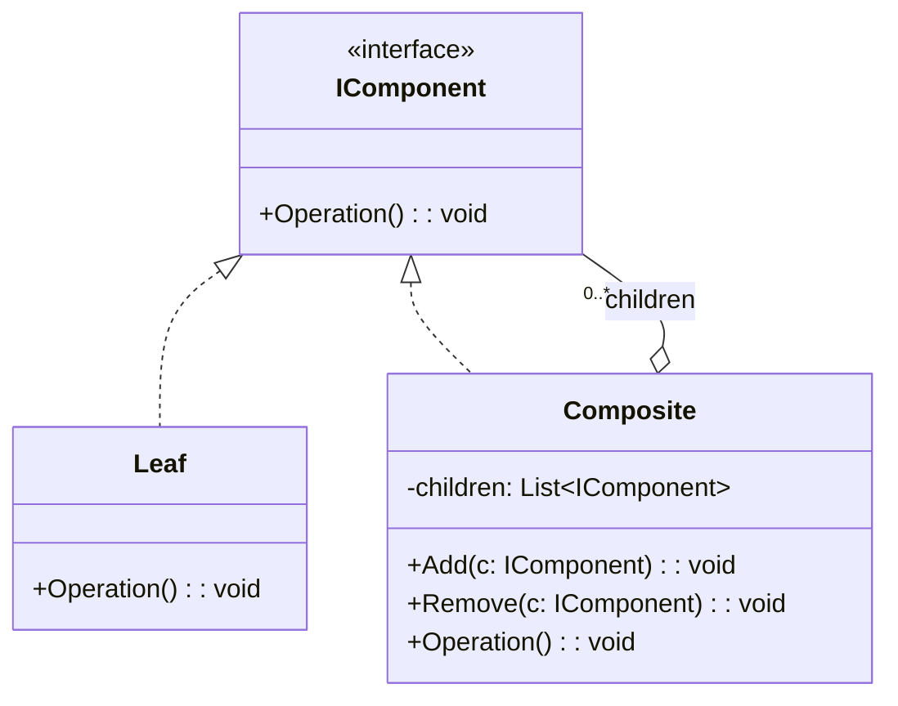
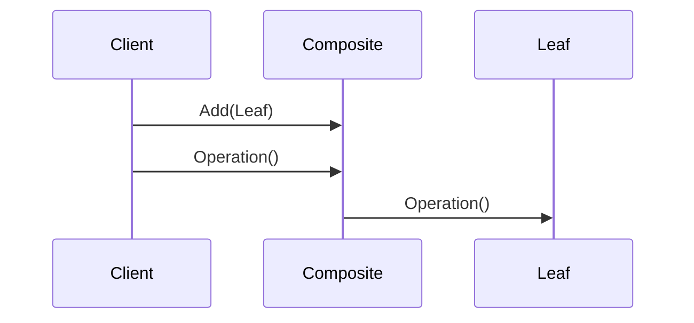
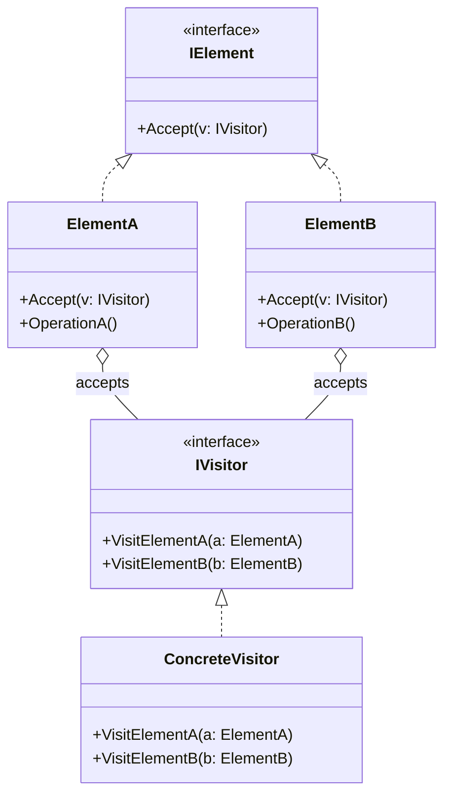
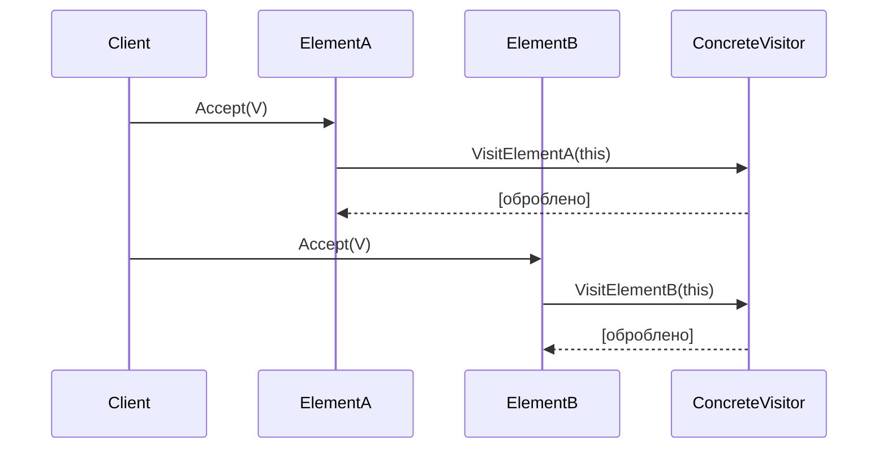
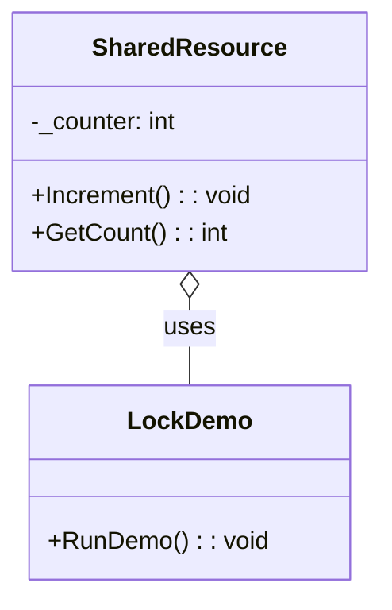
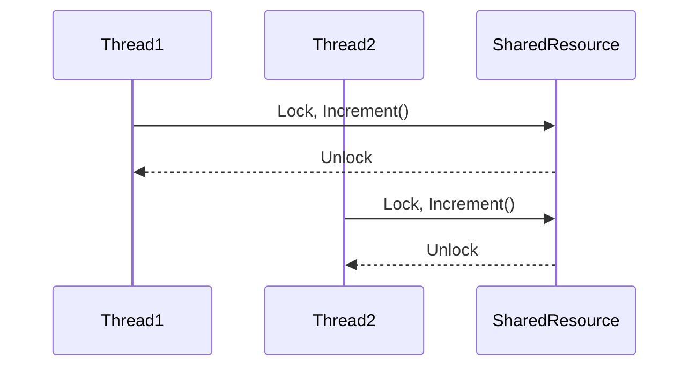

# Design Patterns — Варіант 20

У цьому репозиторії зібрані демонстраційні проекти для шаблонів проектування:

-   **Creational**: Prototype
-   **Structural**: Composite (ще в розробці)
-   **Behavioral**: Hierarchical Visitor (ще в розробці)
-   **Concurrency**: Lock (ще в розробці)

---

## Prototype

Патерн **Prototype** дозволяє створювати нові об'єкти шляхом клонування вже наявних екземплярів, що корисно, коли ініціалізація об'єкта є дорогою чи складною.

### UML-діаграма класів

### UML-діаграма послідовності

### Демонстраційний код

Папка PrototypeDemo/ містить консольний проект з реалізацією IPrototype, ConcretePrototypeA і простим прикладом у Program.cs.

---

## Structural Pattern: Composite

Патерн **Composite** дозволяє клієнтам працювати з ієрархією об'єктів (складених і простих) однаково через спільний інтерфейс.

### UML-діаграма класів

### UML-діаграма послідовності

### Демонстраційний код

Див. папку CompositeDemo/ — консольний проект із реалізацією IComponent, Leaf, Composite та прикладом використання в Program.cs.

---

## Behavioral Pattern: Hierarchical Visitor

Патерн **Visitor** дозволяє додавати нові операції над елементами об'єктної ієрархії, не змінюючи самі класи цих елементів. У варіанті "Hierarchical Visitor" ми демонструємо, як один відвідувач може обробляти різні підкласи елементів.

### UML-діаграма класів

### UML-діаграма послідовності

### Демонстраційний код

Див. папку VisitorDemo/ — консольний проект із реалізацією IVisitor, IElement, двома елементами та одним відвідувачем.

---

## Concurrency Pattern: Lock

Патерн **Lock** (м'ютекс) використовується для синхронізації доступу до спільних ресурсів у багатопотокових сценаріях. Він гарантує, що лише один потік виконує критичну секцію коду одночасно.

### UML-діаграма класів

### UML-діаграма послідовності

### Демонстраційний код

Папка LockDemo/ містить консольний проект, де два потоки безпечним способом інкрементують спільний лічильник використовуючи lock.

---
