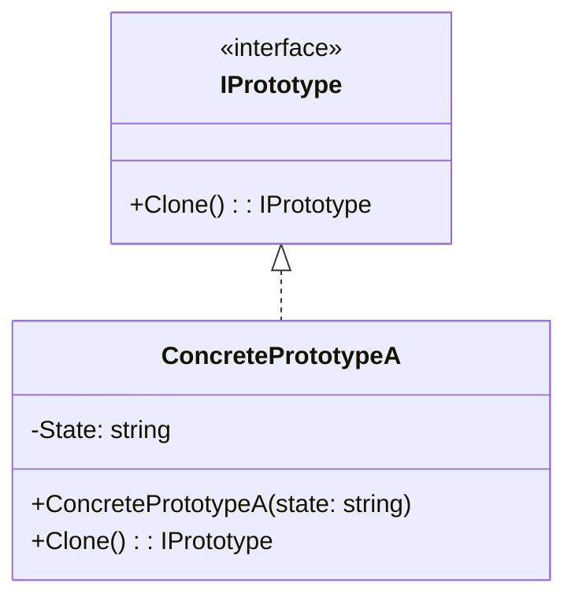
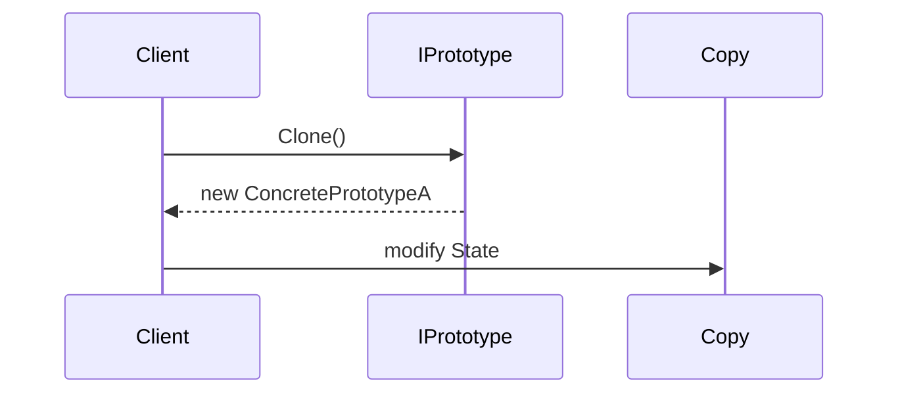

# Design Patterns — Варіант 20

У цьому репозиторії зібрані демонстраційні проекти для шаблонів проектування:

-   **Creational**: Prototype
-   **Structural**: Composite (ще в розробці)
-   **Behavioral**: Hierarchical Visitor (ще в розробці)
-   **Concurrency**: Lock (ще в розробці)

---

## Prototype

Патерн **Prototype** дозволяє створювати нові об'єкти шляхом клонування вже наявних екземплярів, що корисно, коли ініціалізація об'єкта є дорогою чи складною.

### UML-діаграма класів

### UML-діаграма послідовності

### Демонстраційний код

Папка PrototypeDemo/ містить консольний проект з реалізацією IPrototype, ConcretePrototypeA і простим прикладом у Program.cs.

---
